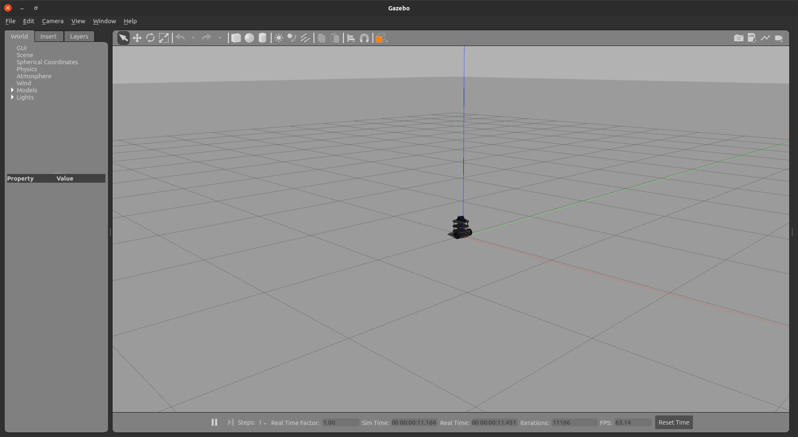
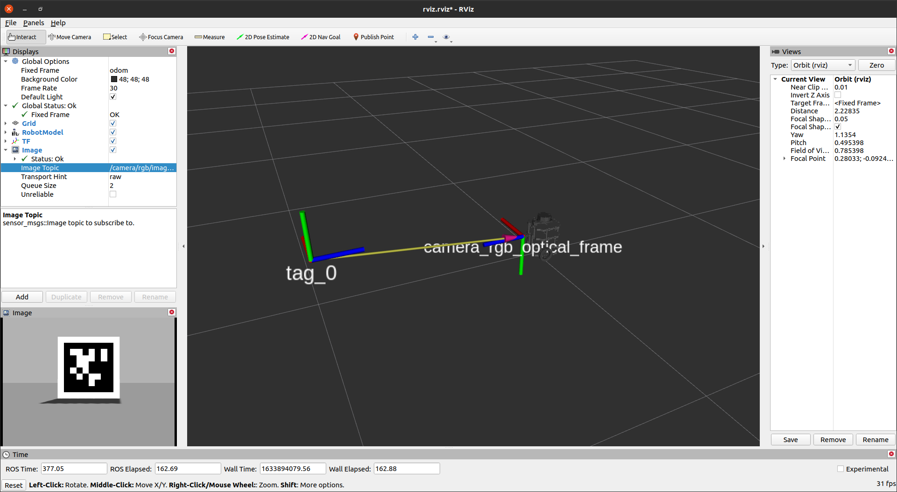

# TurtleBot 3 Starter Code for Mobile Robotics EECE 5550 - Fall 2021

This repo will hold the starter codes for the lab assignemnts. You will build solutions on top of this repository. This tutorial assumes that you have successfuly installed Ubuntu 20.04 and ROS Noetic on your machine. 

## Simulation Setup
0. Head to the TurtleBot 3 Manual: https://emanual.robotis.com/docs/en/platform/turtlebot3/overview/  
1. First read the Overview and Features sections in the manual to get yourself familiar with the platform. 

2. Go to the Section 3.1 PC Setup. Skip part 3.1.1 and 3.1.2 since we already installed Ubuntu and ROS and continue with the part 3.1.3 which installs the dependencies for the TurtleBot 3 packages. Make sure that you selected the Noetic version from the top: 

3. You might get the following error: `no matches found: ros-noetic-rqt*` If you see this error, replace the line `ros-noetic-rqt*` with `ros-noetic-rqt` and run the installation command again. 

4. After you finish this section, the control software for the actual hardware is installed. Now, we will install the simulation. To do so create a ROS workspace as we showed in the class. In case you need a refresher, check out the ROS tutorials: http://wiki.ros.org/catkin/Tutorials/create_a_workspace  Note that the ROS tutorials use the `catkin_make` command but this tutorials uses the `catkin build` command for building the ROS workspace. You can use either one of the but I find `catkin` more useful for debugging the workspace. 

5. Follow the steps below to install the TurtleBot 3 simulator 
    * `cd ~/catkin_ws/src` 
    * `git clone -b noetic-devel https://github.com/ROBOTIS-GIT/turtlebot3_simulations.git `
    * `cd ~/catkin_ws `
    * `catkin build`
    * `source ~/catkin_ws/devel/setup.bash `
6. To confirm the TurtleBot 3 simulation, run the following commands: 
    * `export TURTLEBOT3_MODEL=burger` 
    * `roslaunch turtlebot3_gazebo turtlebot3_empty_world.launch `

7. You should a Gazebo screen with TurtleBot 3 loaded: 

 
8. If you see this section, the TurtleBot 3 simulation is successfully installed. If you don’t get to this point, check previous steps carefully and make sure you didn’t miss any commands. 

## Lab 2 Setup
In this lab assignment, you will simulate a Gazebo environment with a TurtleBot and a Apriltag marker. Apriltags are visual fiducial markers that can be used for pose estimation, localization etc. These markers can be detected and their poses are estimated accuratly with an RGB camera. To run the starter code for the the lab 2, we will install the apritag software and its ROS wrapper:

* To install Apriltags, go to your terminal and simply run this command `sudo apt install ros-noetic-apriltag-ros`

Now, follow the steps below to install this repo.
* `cd ~/catkin_ws/src`
* `git clone https://github.com/tkelestemur/turtlebot3_mr.git`
* `cd turtlebot3_mr/models`
* `cp -r Apriltag36_11_00000 ~/.gazebo/models/`
* `cd ~/catkin_ws`
* `catkin build`
* `source catkin_ws/devel/setup.bash`

To start the Gazebo with the TurtleBot and simulated Apriltag, run the following launch file:
* `roslaunch turtlebot3_mr turtlebot3_lab2.launch`

This launch file will create the Gazebo environment and publish the topics. To see the topics published, run `rostopic list` in another terminal. Some of the useful topics are explained below

* `/camera/rgb/image_raw` : RGB image from the TurtleBot camera
* `/imu` accelerometer and gyroscope data
* `/joint_states` current joint angles
* `/scan` 2D lidar data
* `/tf` transformation for the robot links
* `/cmd_vel` twist velocity command 

To visuliaze the robot, we can use the RViz program. 
* `cd ~/catkin_ws/src/turtlebot3_mr`
* `rosrun rviz rviz -d config/rviz.rviz`

Finally, we will run the Apriltag detection code for finding the pose of the simulated Apriltag.
* `roslaunch turtlebot3_mr apriltag_gazebo.launch`
This will publish the position and orientation of the marker. If you look at the `/tf` topic, you will see the the pose of the marker is constantly published: `rostopic echo /tf`. 

Please take a look at how these launch files are defined to get better understanding of what is going on under the hood. 

## TurtleBot Raspberry Pi Camera Setup
Please follow the instructions below to get the RPi camera working with ROS:

Install dependicies: 
* `sudo apt install libraspberrypi-bin libraspberrypi-dev`
* `sudo apt install ros-noetic-diagnostic-updater`
* `sudo apt install ros-noetic-camera-info-manager`
* `sudo apt install ros-noetic-compressed-image-transport`
* Add these lines to the `/boot/firmware/config.txt` : `start_x=1`, `gpu_mem=128`
   * `sudo vim /boot/firmware/config.txt`  
* Reboot the TurtleBot

Install raspi_cam package:
* `cd catkin_ws/src`
* `https://github.com/UbiquityRobotics/raspicam_node.git`
* `cd catkin_ws`
* `catkin_make`
* `source devel/setup.bash`

Running the camera
* `roslaunch raspicam_node camerav2_1280x960_10fps.launch enable_raw:=true`
* `rosrun tf static_transform_publisher 0.03 0 0.1 0 0 0 base_link camera_link 100`

Note that we publish the pose of the camera with respect to the base_link frame of the robot. This will help you to transform AprilTags pose to the base frame of the robot. 

Intrinsic Calibration:
* To calibrate the intrinsic parameters of the camera, please follow the instructions here: https://github.com/UbiquityRobotics/raspicam_node#calibration
